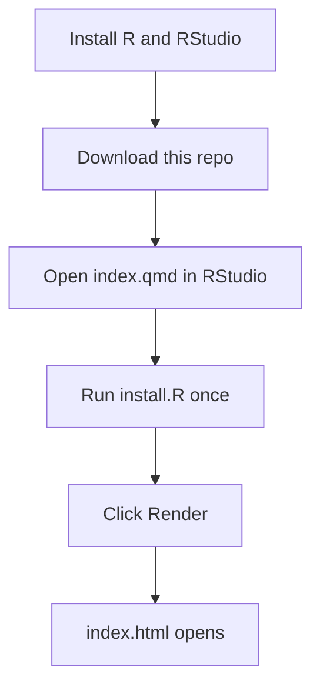

# Datcha - Quarto Tutorial

A tutorial that shows how to track changes between two snapshots of a social media dataset.

It finds **deleted posts**, **added posts**, and **edited posts**, then studies how they differ using word frequency, sentiment, keyness, topic modeling, and edit distance.

Live app: [shiny.gesis.org/datcha](https://shiny.gesis.org/datcha/)

---

## Main file

**`index.qmd`** is the only file you need to run. Everything else is either input data, output, or setup.

---

## What is in this repo

| File / Folder | What it is |
|---|---|
| **`index.qmd`** | **Main file. The full tutorial and all R code.** |
| `index.html` | The finished tutorial (output of `index.qmd`). |
| `index_files/` | Support files for `index.html`. Auto-made. |
| `topic_models/` | Topic model plots, pre-built for each number of topics. Auto-made. |
| `Data1.csv` | Example data, first collection. |
| `Data2.csv` | Example data, second collection. |
| `install.R` | Installs all R packages needed. |
| `reference.bib` | Citations used in the tutorial. |
| `citation.cff` | How to cite this tool. |
| `LICENSE` | MIT licence terms. |
| `manifest.json` | Package versions, for deployment. |

Both CSV files have 2 columns: `col_id` and `text`.

---

## How to run

### Steps

| Step | What to do |
|---|---|
| 1 | Install [R](https://cran.r-project.org/) and [RStudio](https://posit.co/download/rstudio-desktop/). |
| 2 | Download or clone this repo. |
| 3 | Open the folder in RStudio. |
| 4 | Run `install.R` once. This installs all packages. |
| 5 | Open `index.qmd`. |
| 6 | Click **Render** (or press `Ctrl+Shift+K`). |

The tutorial opens as a web page. First render is slow, because all topic models are built.

---

## Use your own data

Open `index.qmd` and change these lines:

| Line | Change |
|---|---|
| [80](index.qmd#L80) | Path to your two CSV files. A URL or a local file works. |
| [107](index.qmd#L107) | Name of your ID column. |
| [125](index.qmd#L125) | The two collection dates. Date 1 must be earlier. |

Your data must be anonymised before you use it.

---

## Good to know

- **Open the page with Render or a web server.** If you double-click `index.html` and open it as a file, the topic model plots stay blank. This is a browser rule, not a bug.
- **The λ slider needs a topic first.** In the topic plots, click a topic circle on the left. Only then does the λ slider re-sort the words. With no topic picked, the slider does nothing.
- **Big data is cut down.** Topic modeling uses at most 8000 posts. You can change this at [line 589](index.qmd#L589).

---

## Help

If you find any issues or something not working, kindly contact Dr Yannik Peters (yannik.peters@gesis.org) or Kunjan Shah (kunjan.shah@gesis.org).

---

## Cite

See `citation.cff`. Licence: [MIT](LICENSE).
